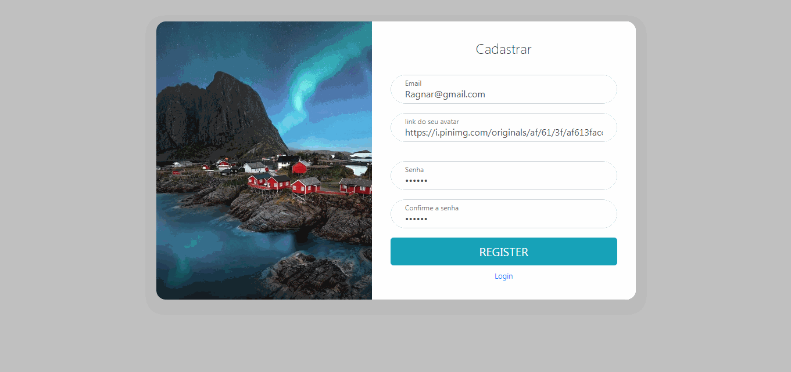

 # Vou arrumar o Readme para a explicação até terça-feira(19/02/2020)
> O código está funcional e todo comentado


<p align="center">
  <a aria-label="Versão do Node" href="https://github.com/nodejs/node/blob/master/doc/changelogs/CHANGELOG_V12.md#12.14.1">
    </img>
  </a>
  <a aria-label="Versão do React" href="https://github.com/facebook/react/blob/master/CHANGELOG.md#16120-november-14-2019">
    </img>
  </a>
  <a aria-label="Versão do Expo" href="https://developer.mozilla.org/en-US/docs/Web/API/WebSockets_API/Writing_WebSocket_client_applications">
    </img>
  </a>
</p>

a versão  **chat demonstração** é a demostrada no gif e está mais completa. Já vem com o banco de dados(cha demonstração\chat-backend\src\database.sql)

a versão **chat para implantação** contem código mais básico, para voce poder editar com mais facilidade e adicionar seu banco de dado

## Instalação
execute o comando na pasta chat-backend

```bash
yarn install
```

## Como usar



**chat demonstração:**
Basta criar uma conta e fazer o login, após isso basta clicar em um dos usuários do chat e iniciar o bate-papo

**chat para implantação:**
Quando você iniciar a aplicação, será levado um chat coletivo, onde tu que enviar, as demais pessoas que estiverem utilizando o chat receberá a mensagem

## Licença

[MIT](./LICENSE) &copy; [Rocketseat](https://rocketseat.com.br/)
